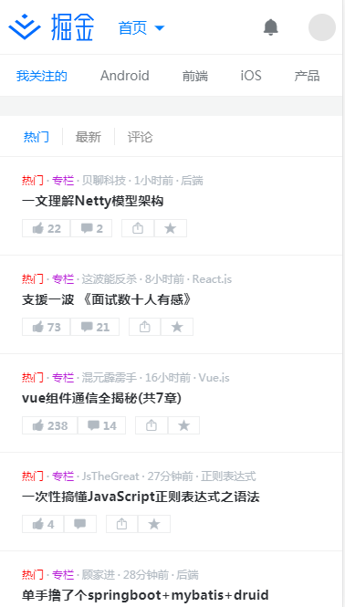
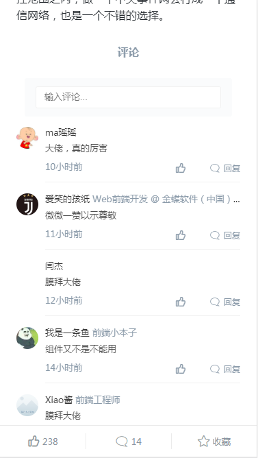
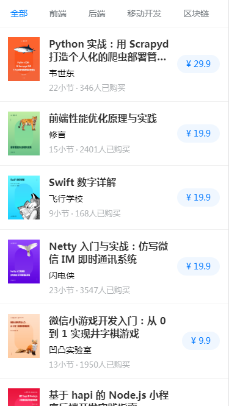
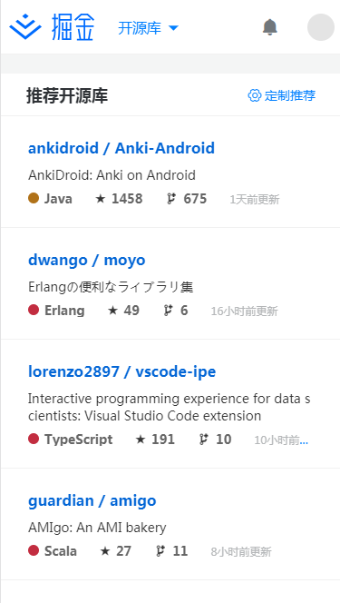
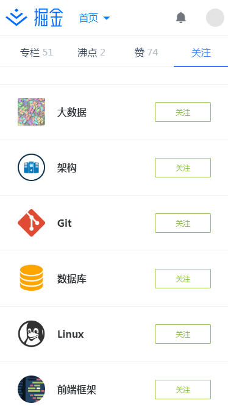
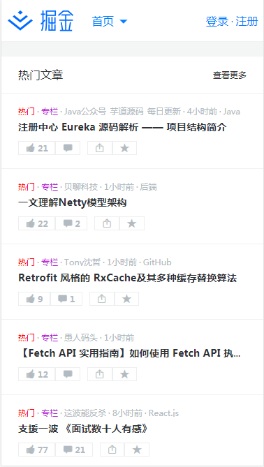

# react-juejin
一个高仿的掘金，大部分是按照掘金的ui来实现的，个别地方就根据自己想法修修改改，只做了移动端的部分，还做pc的部分就要花太多时间了，支持服务端渲染、pwa等，写这个项目主要是对近几个月所学的技术做个实践，看看有哪里还有不足，以及在实际开发的时候会踩到哪些坑，该怎么解决

## 运行
```
yarn or npm install

# development
npm run dev:client
npm run dev:server

# production
npm run build
npm start
```

## 技术栈
- react
- react-dom
- react-router-dom
- react-helmet （设置title及meta）
- react-loadable
- react-redux
- redux-connect （异步路由跳转）
- react-router-config
- react-virtual-list （长列表渲染）
- prop-types
- @rematch/core （rematch 一个更好用的redux）
- @rematch/loading （调用effects时，自动设置loading）
- immer （以带副作用的方式修改数据并返回新引用的数据，不会影响原始数据）
- axios
- babel-polyfill
- classnames
- lodash-es
- react-swipe
- react-toastify
- react-content-loader （内容占位的loading）
- react-lazyload
- react-swipe
- swipe-js-is
- husky （husky注册git hook）
- lint-staged  （对被提交的文件依次执行写好的任务）
- webpack
- eslint
- express

## 实现的功能
- 公共头部
    - 登录
- 首页
    - 文章点赞
    - 切换分类
- 文章页
    - 评论列表
    - 评论点赞
    - 推荐文章列表
- 沸点页
- 小册
- 开源库
- 活动页
- 用户主页
    - 关注用户
    - 用户动态列表
    - 用户专栏
    - 用户沸点
    - 用户的点赞
    - 用户关注的标签

大概就是以上的功能，登录的话只支持手机登录，或者可以手动设置一个这样的`cookie`，再刷新页面就登录成功了
```js
const userInfo = {
    token: data.token,
    clientId: data.clientId,
    uid: data.user.uid
}
Cookies.set('userInfo', userInfo, { path: '/' })
```

## 项目结构
```
├─.gitattributes
├─ecosystem.json    pm2部署配置
├─src
|  ├─app.jsx
|  ├─entry-client.js
|  ├─entry-server.js
|  ├─registerServiceWorker.js
|  ├─utils      工具函数
|  ├─store      store配置
|  ├─routes     路由配置
|  ├─models     store的model文件，创建state、reducers、effects
|  ├─containers     页面组件
|  ├─components     展示组件
|  ├─assets     需要webpack处理的资源
|  ├─api      对请求库的封装及获取数据的方法
├─server    服务端渲染
├─public    静态资源
├─build     webpack配置
|   ├─dll   生成dll的配置
├─.vscode
|    └launch.json
```

## 预览

### 首页




### 文章页




### 沸点


### 小册



### 开源库



### 活动


### 用户页






## 最后
要是感兴趣的话，可以自行看代码，大部分内容还是比较简单的，有问题的话欢迎提出了一起讨论

> [项目地址][1]
> [线上地址][2]


  [1]: https://github.com/Kim09AI/react-juejin
  [2]: https://react-juejin.foreversnsd.cn/
